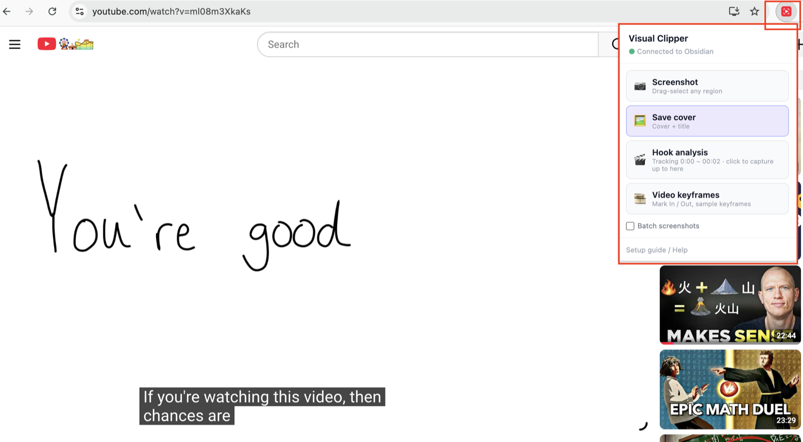

# Visual Clipper

English | [简体中文](README.zh-CN.md)

<!-- 🎬 Demo video placeholder. Replace this line with the video embed when it is ready. -->
> 🎬 Demo video coming soon

Save what you see. Visual Clipper is a Chrome extension that clips screenshots, video covers, opening hooks, and keyframes from any webpage into **Obsidian** or **Notion**, in one click.

Clips from the same video always land in the same note. Save the cover today, grab a hook tomorrow, mark keyframes next week: it all builds into one tidy note per video. Your clips go only to your own vault or your own Notion workspace. No accounts, no cloud, no telemetry.

## What you need

- Chrome
- [Obsidian](https://obsidian.md) or [Notion](https://www.notion.so), either one

## Install

**Chrome Web Store: coming soon.** Until then, install manually. It takes two minutes.

1. Download [visual-clipper.zip](https://github.com/echore/visual-clipper/releases/latest/download/visual-clipper.zip) and unzip it
2. Open `chrome://extensions` and turn on **Developer mode** (top right corner)
3. Click **Load unpacked** (top left corner) and pick the folder you just unzipped

A welcome page opens on its own. It asks where you want your clips (Obsidian or Notion) and walks you through the rest with live checks and step by step screenshots. When the status light turns green, you are ready.

## How to use

Open any webpage or video page (YouTube and Bilibili are fully supported), click the Visual Clipper icon, and pick a mode:

| Mode | What it does |
|---|---|
| 📷 Screenshot | Drag to select any region of the page and save it |
| 🖼️ Cover | Save the video cover and its info in one click |
| 🎬 Hook | Sample the opening frames plus subtitles, then pick the best hook frame |
| 🎞️ Keyframe | Mark In and Out points on a video, then sample frames across that range |

Every clip saves instantly and links you straight back to the note it created.

## Support this project

If Visual Clipper is useful to you, a ⭐ [Star](https://github.com/echore/visual-clipper) helps a lot.

## License

[MIT](LICENSE)
